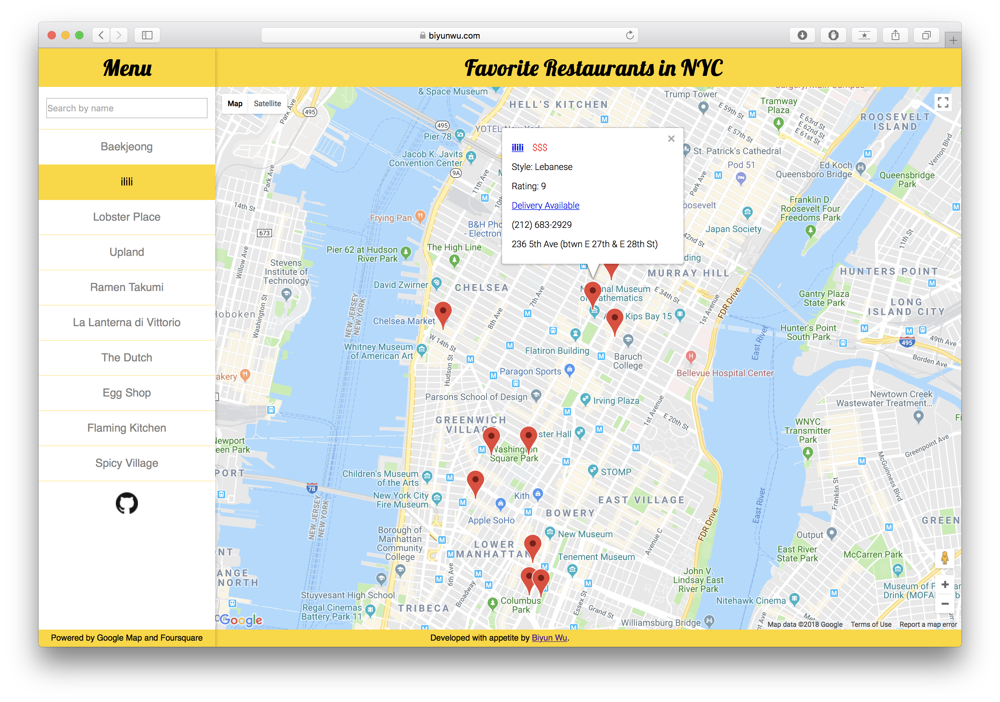
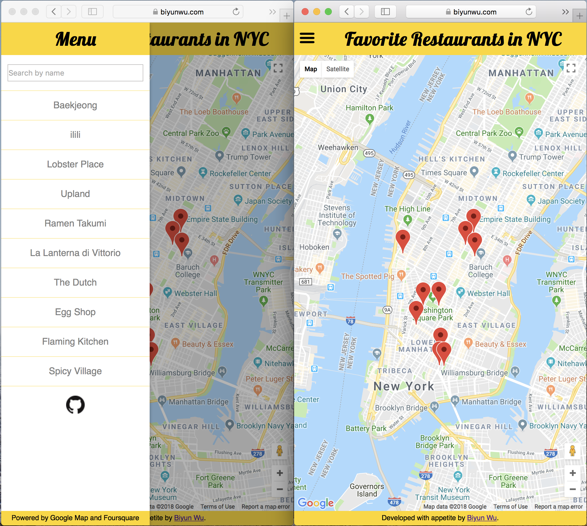
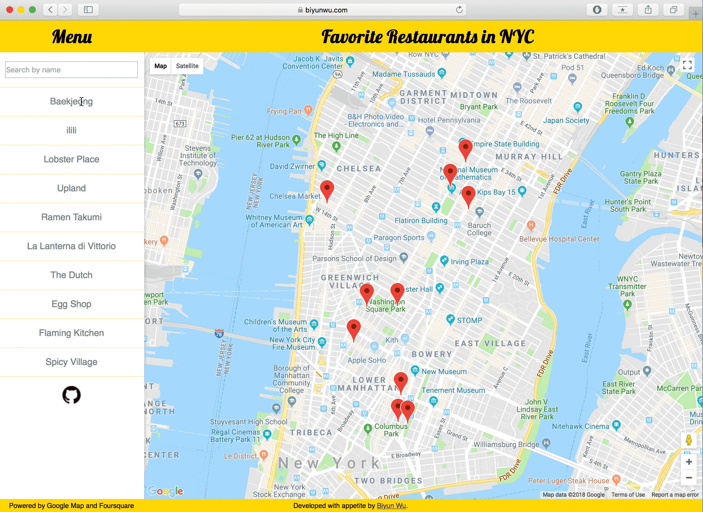
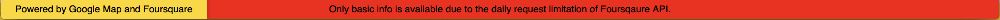

# [Favorite Restaurants in NYC](https://biyunwu.com/react-neighbourhood-map/)

## Intriduction

  This is the final project of my Udacity Front-end Nanodegree program which is funded by Google Scholarship.

  The project was bootstrapped with [Create React App](https://github.com/facebookincubator/create-react-app) and powered by Google Maps and Foursquare APIs.

  **Check the [live demo](https://biyunwu.com/react-neighbourhood-map/).**

## Project Structure

```bash
├── README.md - This file.
├── package.json
├── public
│   ├── favicon.ico
│   └── index.html
└── src
    ├── App.js # This is the root of the app.
    ├── App.css # Styles for the app.
    ├── Data.js #Feed basic info of restaurants
    ├── bar.svg #Burger icon
    ├── GitHub.png
    ├── App.test.js # Used for testing. Provided with Create React App.
    └── components # Components that constitute the app. See below for more details.
        ├── GoogleMapsContainer.jsx
        ├── Search.jsx
        ├── Header.jsx
        └── Footer.jsx
```

## Run the Project

### Run in dev mode:

* Clone or download the project.
* Use `$ npm install` command to install all the dependencies.
* `$ npm start` to run the project.

## Responsiveness and Layout

This project is designed to be responsive. When the width of the viewport is equal to or above 800px, the sidebar is docked and the burger icon in the header is hidden automatically. Otherwise, the sidebar is hidden and the burger icon is visible. See the below images for more details.

### Desktop Version



### Mobile Version



## Functionality

### Marker

* Clicking any marker (restaurant) on the map trigers a fetching execution to get detailed info about the restaurant from Foursquare.

* Then, the filtered info will be shown in the marker's info window. The info includes the restaurant's name, pricing tier, ethnic or regional flavor, rating, dilivery info, contact and address. Besides, the restaurant's official website and third party delivery wensite address are available, they are going to be embeded in the corresponding texts.

* After the marker is cliked, the corresponding list item's backgorund in the sidebar changes.

* Please refer to the Layout section for more details.

### Sidebar

* Search. The search field accepts users' inputs to filter matching result. The markers are updated simultaneously.
* Click list item. Clicking any list item in the sidebar trigers the corresponding marker's drop animation as the following gif shows.



### Warning

Beacause of the limited quota of Foursquare, the info window may only show the restaurant's basic info. In this situation, the footer changes the background to red along with a warning as the following image shows.



## API

* [Google Maps](https://developers.google.com/maps/documentation/)
* [Foursquare](https://developer.foursquare.com/docs)

## Attribution

* [google-maps-react](https://github.com/fullstackreact/google-maps-react)
* [react-sidebar](https://github.com/balloob/react-sidebar)
* [Google Fonts](https://fonts.google.com)

## Contribution

All pull requests are welcome.